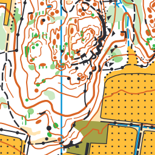
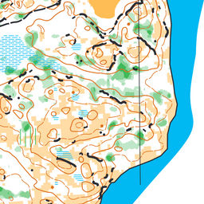
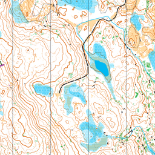

# panmap

Read OCAD/OCD and OpenOrienteering Mapper OMap/XMap map files into a shared
PanMap model, then export that model to GeoJSON, SVG, GitMap, or visual map
diffs.

Supported inputs: OCAD 10, 11, 12, 2018 and OMap/XMap XML v9.





## Install

```sh
npm install panmap
```

## API

```js
import {
  read, write, convert, exportMap,
  ocad, omap, gitmap,
  diff, diffMapsToSvg,
  mapToGeoJson, mapToSvg, getMapSvgRenderSupport,
} from 'panmap'
```

Top-level:

- `read(input, options?)` — parse an OCAD, OMap/XMap, or GitMap package into
  a `PanMap`. `input` is a file path, `Buffer`, or XML string.
- `write(map, path, options?)` — write a `PanMap` to a native format
  (`ocd` / `omap` / `xmap` / `gitmap` — chosen by extension or `options.format`).
- `convert(input, path, options?)` — read + write in one call (lossless
  conversion between native formats).
- `exportMap(map, path, options?)` — export to a lossy target (`svg`, `geojson`).
- `diff(before, after, options?)` — compare two maps; returns added, removed,
  modified, and (optionally) unchanged geometry.
- `mapToSvg(map, options?)` / `mapToGeoJson(map, options?)` — direct exporters.
- `diffMapsToSvg(before, after, options?)` — compare two maps and render the
  diff as SVG.
- `getMapSvgRenderSupport(map)` — reports whether every object can be
  rendered directly from PanMap render layers.

Per-format namespaces expose the raw readers/writers for callers that need
to work below the `PanMap` model:

- `ocad.readRaw(input, options?)` → low-level `OcadFile`
- `ocad.toMap(ocadFile)` → `PanMap`
- `ocad.read(input, options?)` → shortcut for `toMap(readRaw(...))`
- `ocad.write(map, path)` → write OCAD binary
- `omap.readRaw(input)` / `omap.toMap(...)` / `omap.read(...)` / `omap.write(...)`
- `gitmap.read(directory)` / `gitmap.write(map, directory)`

## GitMap

GitMap is the revision-control-friendly package format used to store maps in
Git. A package is a small directory: `manifest.json` plus `colors.ndjson`,
`symbols.ndjson`, and `objects.ndjson`, one record per line, so `git diff` on
map edits produces a minimal, human-readable diff. See
[gitmap/README.md](../gitmap/README.md) for the format specification.

## SVG rendering

SVG export is handled by a shared render-layer renderer for both OCAD/OCD
and OMap/XMap inputs. Supported layer types: fills, strokes, hatches,
structure and point patterns, point-symbol elements, line symbols,
double lines, border symbols, combined symbols, text, and diff overlays.

## CLI

```sh
panmap info map.ocd
panmap export map.ocd map.svg
panmap export map.ocd map.svg --white-background
panmap export map.ocd map.geojson
panmap convert map.ocd map.omap
panmap convert map.ocd map.gitmap
panmap export map.gitmap map.svg
```

## Missing / partial features

- Text kerning and complex text layouts are best-effort.
- OCAD binary encoding for from-scratch (non-OCAD-sourced) maps is
  best-effort; OCAD-sourced maps round-trip via a mix of byte preservation
  and field-level re-encoding.

Open an issue if you hit a shape that doesn't round-trip cleanly.

## Development

```sh
npm install
npm test           # tsc + eslint + ava
npm run build      # emit dist/ (JS + .d.ts)
npm run parity     # OCD parity vs Mapper's own output (needs local fixtures)
```

The parity suite compares panmap's OCD export against Mapper's binaries for
real maps. Those fixtures are private and gitignored (`test/parity-fixtures/`),
so it's a local-only tool, kept out of the default `npm test`.

## License

[AGPL-3.0](LICENSE).
